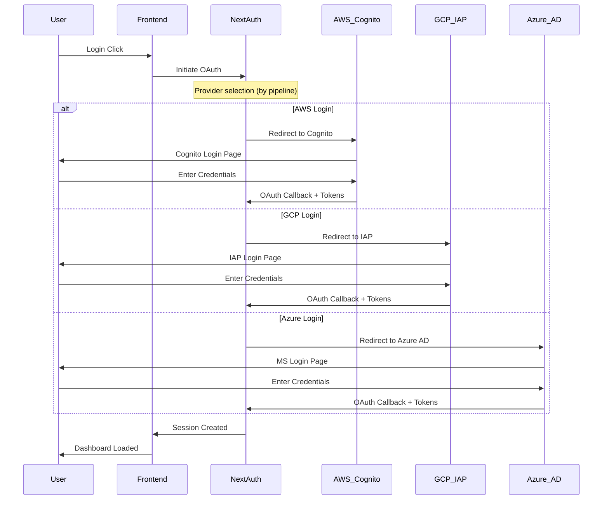

# PRD 01 - Frontend Architecture

**Version:** 1.0  
**Date:** 2026-04-16  
**Related To:** Master PRD  
**Status:** Draft

---

## 1. Overview

### 1.1 What Are We Building?

```
┌─────────────────────────────────────────────────────────────────────────────┐
│                        FRONTEND ARCHITECTURE                                 │
├─────────────────────────────────────────────────────────────────────────────┤
│                                                                              │
│   ┌─────────────────────────────────────────────────────────────────────┐   │
│   │                    UNIFIED DASHBOARD                                 │   │
│   │              (Single Frontend - Next.js 14)                          │   │
│   │                                                                       │   │
│   │  ┌─────────────┐  ┌─────────────┐  ┌─────────────┐                 │   │
│   │  │ AWS Panel   │  │ GCP Panel   │  │ Azure Panel │  ┌─────────────┐ │   │
│   │  │             │  │             │  │             │  │DB Panel     │ │   │
│   │  │• Metrics    │  │• Metrics    │  │• Metrics    │  │• Metrics    │ │   │
│   │  │• Deployments│  │• Deployments│  │• Deployments│  │• Deployments│ │   │
│   │  │• AI Chat    │  │• AI Chat    │  │• AI Chat    │  │• AI Chat    │ │   │
│   │  │• BI Embed   │  │• BI Embed   │  │• BI Embed   │  │• BI Embed   │ │   │
│   │  └─────────────┘  └─────────────┘  └─────────────┘  └─────────────┘ │   │
│   └─────────────────────────────────────────────────────────────────────┘   │
│                                                                              │
│   ┌─────────────────────────────────────────────────────────────────────┐   │
│   │                   SHARED UI COMPONENTS                                │   │
│   │                                                                       │   │
│   │   • Reusable Dashboard Cards    • Unified Navigation                  │   │
│   │   • Cross-Cloud Charts          • Multi-Agent Chat Interface          │   │
│   │   • BI Embed Components         • Authentication & Authorization      │   │
│   │   • Theme System (Dark/Light)   • Responsive Design                   │   │
│   └─────────────────────────────────────────────────────────────────────┘   │
│                                                                              │
└─────────────────────────────────────────────────────────────────────────────┘
```

### 1.2 Why Monorepo with Shared Packages?

**Q: Why use a monorepo structure for frontends?**

**A:** Monorepo with independent deployable units provides the best balance:

| Consideration | Multi-Repo | Monorepo (Chosen) |
|--------------|------------|-------------------|
| Code Sharing | Copy-paste or separate packages | Shared packages (`packages/`) |
| CI/CD | Complex matrix | Simple per-component pipelines |
| Team Coordination | Hard to sync changes | Easy via monorepo tools |
| Deployment | Independent | Independent via Nx |
| Type Safety | Requires extra tooling | Shared types directly |
| Onboarding | Multiple repos to understand | Single repo |

**Conclusion:** We use **Nx** for monorepo management with shared packages (`packages/shared`, `packages/contracts`, `packages/ui`) while maintaining independent deployments per pipeline frontend.

---

### 1.3 Why pnpm Over npm or yarn?

**Q: Why use pnpm as the package manager?**

**A:** pnpm is the modern standard for enterprise monorepos:

| Aspect | npm | yarn | pnpm (Chosen) |
|--------|-----|------|---------------|
| Disk Usage | Copies packages per project | Copies packages per project | Hard links, ~50% less space |
| Installation Speed | Slow | Medium | Fast (parallel install) |
| Monorepo Support | Basic | Good | Native, excellent |
| Phantom Dependencies | Allowed (causes bugs) | Allowed | Strict (prevents bugs) |
| Node Modules Structure | Flat (allows conflicts) | Flat | Strict (no phantom deps) |
| Lockfile Format | package-lock.json | yarn.lock | pnpm-lock.yaml |

**Key advantages for this project:**
- **Hard linking** saves disk space across 5 frontends (aws, gcp, azure, databricks, unified)
- **Strict mode** prevents accidental dependencies on packages not explicitly declared
- **Native monorepo** support via workspaces without extra configuration
- **Works with Nx** seamlessly for build orchestration

**CI/CD implication:** GitHub Actions needs `corepack enable && pnpm install` before running pnpm commands. This is documented in all pipeline configurations.

---

## 2. Frontend Specifications

### 2.1 Unified Dashboard (MASTER)

| Property | Value |
|----------|-------|
| **Framework** | Next.js 14 (App Router) |
| **Language** | TypeScript 5.x |
| **Styling** | Tailwind CSS + shadcn/ui |
| **State Management** | Zustand |
| **Data Fetching** | TanStack Query (React Query) |
| **Charts** | Recharts + D3.js |
| **BI Embedding** | @microsoft/powerbi-client-react + tableau-js-api |
| **Real-time** | Socket.io-client |
| **Auth** | NextAuth.js |
| **Testing** | Playwright + Vitest |

### 2.2 Pipeline-Specific Frontends

| Pipeline | Framework | Unique Features |
|----------|-----------|-----------------|
| AWS | Next.js 14 | AWS-specific UI, Bedrock chat |
| GCP | Next.js 14 | GCP-specific UI, Gemini chat |
| Azure | Next.js 14 | Azure-specific UI, AOAI chat |
| Databricks | Next.js 14 | Databricks-specific UI, DBRX chat |

**Q: Why use Next.js for all frontends instead of pure React?**

**A:** Next.js provides significant advantages for enterprise dashboards:

| Feature | Benefit |
|---------|---------|
| **Server-Side Rendering (SSR)** | Better SEO for public pages, faster initial load |
| **Static Site Generation (SSG)** | Pre-render static pages, CDN caching |
| **API Routes** | Easy backend-for-frontend pattern |
| **Image Optimization** | Automatic image optimization |
| **Built-in Performance** | Automatic code splitting, prefetching |
| **TypeScript Support** | End-to-end type safety |

### 2.3 Shared Packages

```
packages/
├── shared/
│   ├── types/                    # Shared TypeScript interfaces
│   │   ├── api.types.ts         # API request/response types
│   │   ├── user.types.ts        # User & auth types
│   │   ├── pipeline.types.ts    # Pipeline configuration types
│   │   └── ml.types.ts          # ML model & metrics types
│   │
│   ├── ui/                       # Shared UI component library
│   │   ├── components/
│   │   │   ├── dashboard-card.tsx
│   │   │   ├── metric-chart.tsx
│   │   │   ├── ai-chat.tsx
│   │   │   ├── bi-embed.tsx
│   │   │   └── unified-nav.tsx
│   │   └── index.ts
│   │
│   ├── hooks/                    # Shared React hooks
│   │   ├── usePipeline.ts
│   │   ├── useAuth.ts
│   │   └── useMetrics.ts
│   │
│   └── constants/                # Shared constants
│       ├── config.ts
│       └── endpoints.ts
│
└── contracts/                     # API contract definitions
    └── api-contracts.json
```

---

## 3. Component Architecture

### 3.1 Directory Structure

```
frontends/
├── unified-dashboard/             # MASTER Dashboard
│   ├── src/
│   │   ├── app/                  # Next.js App Router
│   │   │   ├── layout.tsx        # Root layout
│   │   │   ├── page.tsx          # Home (dashboard overview)
│   │   │   ├── (auth)/
│   │   │   │   ├── login/
│   │   │   │   └── register/
│   │   │   ├── (dashboard)/
│   │   │   │   ├── layout.tsx    # Dashboard layout
│   │   │   │   ├── page.tsx      # Overview
│   │   │   │   ├── aws/
│   │   │   │   │   └── page.tsx  # AWS pipeline view
│   │   │   │   ├── gcp/
│   │   │   │   │   └── page.tsx
│   │   │   │   ├── azure/
│   │   │   │   │   └── page.tsx
│   │   │   │   ├── databricks/
│   │   │   │   │   └── page.tsx
│   │   │   │   └── settings/
│   │   │   │       └── page.tsx
│   │   │   └── api/              # API Routes (BFF pattern)
│   │   │       ├── auth/
│   │   │       ├── pipelines/
│   │   │       └── ml/
│   │   │
│   │   ├── components/
│   │   │   ├── ui/              # shadcn/ui components
│   │   │   │   ├── button.tsx
│   │   │   │   ├── card.tsx
│   │   │   │   └── ...
│   │   │   │
│   │   │   ├── layout/
│   │   │   │   ├── sidebar.tsx
│   │   │   │   ├── header.tsx
│   │   │   │   └── footer.tsx
│   │   │   │
│   │   │   ├── dashboard/
│   │   │   │   ├── overview.tsx
│   │   │   │   ├── kpi-cards.tsx
│   │   │   │   └── activity-feed.tsx
│   │   │   │
│   │   │   ├── charts/
│   │   │   │   ├── deployment-chart.tsx
│   │   │   │   ├── cost-chart.tsx
│   │   │   │   └── latency-chart.tsx
│   │   │   │
│   │   │   ├── ai-agents/
│   │   │   │   ├── chat-interface.tsx
│   │   │   │   ├── agent-selector.tsx
│   │   │   │   └── message-bubble.tsx
│   │   │   │
│   │   │   ├── bi-embed/
│   │   │   │   ├── power-bi-viewer.tsx
│   │   │   │   ├── tableau-viewer.tsx
│   │   │   │   └── bi-selector.tsx
│   │   │   │
│   │   │   └── pipeline/
│   │   │       ├── aws-panel.tsx
│   │   │       ├── gcp-panel.tsx
│   │   │       ├── azure-panel.tsx
│   │   │       └── databricks-panel.tsx
│   │   │
│   │   ├── lib/
│   │   │   ├── api.ts           # API client
│   │   │   ├── auth.ts          # Auth utilities
│   │   │   └── utils.ts         # Helper functions
│   │   │
│   │   ├── hooks/              # Custom React hooks
│   │   │   ├── use-pipeline.ts
│   │   │   ├── use-ml-models.ts
│   │   │   ├── use-deployments.ts
│   │   │   └── use-ai-chat.ts
│   │   │
│   │   ├── store/              # Zustand stores
│   │   │   ├── auth-store.ts
│   │   │   ├── pipeline-store.ts
│   │   │   └── ui-store.ts
│   │   │
│   │   ├── types/              # Dashboard-specific types
│   │   └── styles/
│   │       └── globals.css
│   │
│   ├── public/
│   ├── .env.local              # Environment variables
│   ├── next.config.js
│   ├── tailwind.config.ts
│   ├── tsconfig.json
│   ├── package.json
│   ├── Dockerfile
│   └── Makefile
│
├── aws-frontend/               # AWS-specific dashboard
│   ├── src/
│   │   ├── app/
│   │   │   ├── layout.tsx
│   │   │   ├── page.tsx
│   │   │   └── (routes)/
│   │   │       ├── sagemaker/
│   │   │       ├── ecs/
│   │   │       ├── glue/
│   │   │       └── bedrock/
│   │   │           └── page.tsx      # AI Agent chat
│   │   │
│   │   ├── components/
│   │   │   ├── aws-specific/
│   │   │   │   ├── sagemaker-studio.tsx
│   │   │   │   ├── ecs-dashboard.tsx
│   │   │   │   └── bedrock-chat.tsx   # Google ADK Chat
│   │   │   │
│   │   │   └── shared/               # From packages/shared
│   │   │
│   │   └── lib/
│   │       ├── aws-client.ts         # AWS SDK setup
│   │       └── bedrock-client.ts    # Bedrock client
│   │
│   ├── Dockerfile
│   ├── Makefile
│   └── package.json
│
├── gcp-frontend/               # GCP-specific dashboard
├── azure-frontend/             # Azure-specific dashboard
└── databricks-frontend/        # Databricks-specific dashboard
```

---

## 4. Key Components Detail

### 4.1 Unified Navigation

```tsx
// components/layout/unified-nav.tsx

import { useSession, signOut } from 'next-auth/react';
import Link from 'next/link';
import { usePathname } from 'next/navigation';
import { cn } from '@/lib/utils';

interface NavItem {
  name: string;
  href: string;
  icon: LucideIcon;
}

const navigation: Record<string, NavItem[]> = {
  overview: [
    { name: 'Dashboard', href: '/', icon: LayoutDashboard },
    { name: 'Analytics', href: '/analytics', icon: BarChart3 },
  ],
  pipelines: [
    { name: 'AWS', href: '/aws', icon: Cloud },
    { name: 'GCP', href: '/gcp', icon: CloudCog },
    { name: 'Azure', href: '/azure', icon: CloudSun },
    { name: 'Databricks', href: '/databricks', icon: Database },
  ],
  ml: [
    { name: 'Models', href: '/models', icon: Brain },
    { name: 'Training', href: '/training', icon: Cpu },
    { name: 'Inference', href: '/inference', icon: Zap },
  ],
  tools: [
    { name: 'AI Agents', href: '/agents', icon: Bot },
    { name: 'BI Reports', href: '/reports', icon: FileBarChart },
    { name: 'Settings', href: '/settings', icon: Settings },
  ],
};

export function UnifiedNav() {
  const pathname = usePathname();
  const { data: session } = useSession();

  return (
    <nav className="flex h-full">
      {/* Logo & Brand */}
      <div className="flex items-center px-4 border-r">
        <Link href="/" className="flex items-center gap-2">
          <div className="w-8 h-8 rounded-lg bg-gradient-to-br from-blue-500 to-purple-600" />
          <span className="font-semibold">EMMP</span>
        </Link>
      </div>

      {/* Main Navigation */}
      <div className="flex-1 flex">
        {Object.entries(navigation).map(([section, items]) => (
          <div key={section} className="flex items-center">
            {items.map((item) => {
              const isActive = pathname === item.href;
              return (
                <Link
                  key={item.name}
                  href={item.href}
                  className={cn(
                    'flex items-center gap-2 px-4 py-3 text-sm font-medium transition-colors',
                    isActive
                      ? 'text-primary bg-primary/10 border-b-2 border-primary'
                      : 'text-muted-foreground hover:text-foreground hover:bg-muted'
                  )}
                >
                  <item.icon className="w-4 h-4" />
                  {item.name}
                </Link>
              );
            })}
          </div>
        ))}
      </div>

      {/* User Menu */}
      <div className="flex items-center px-4">
        <DropdownMenu>
          <DropdownMenuTrigger asChild>
            <Button variant="ghost" className="gap-2">
              <Avatar className="w-8 h-8">
                <AvatarImage src={session?.user?.image} />
                <AvatarFallback>{session?.user?.name?.[0]}</AvatarFallback>
              </Avatar>
              <span className="hidden md:inline">{session?.user?.name}</span>
            </Button>
          </DropdownMenuTrigger>
          <DropdownMenuContent align="end">
            <DropdownMenuItem>Profile</DropdownMenuItem>
            <DropdownMenuItem>Settings</DropdownMenuItem>
            <DropdownMenuSeparator />
            <DropdownMenuItem onClick={() => signOut()}>
              Sign Out
            </DropdownMenuItem>
          </DropdownMenuContent>
        </DropdownMenu>
      </div>
    </nav>
  );
}
```

### 4.2 Multi-Agent Chat Interface

```tsx
// components/ai-agents/chat-interface.tsx

import { useState, useRef, useEffect } from 'react';
import { useAIChat } from '@/hooks/use-ai-chat';
import { cn } from '@/lib/utils';
import { AgentSelector } from './agent-selector';
import { MessageBubble } from './message-bubble';
import { ChatInput } from './chat-input';

interface ChatInterfaceProps {
  className?: string;
  defaultAgent?: 'aws' | 'gcp' | 'azure' | 'databricks' | 'meta';
}

export function ChatInterface({ className, defaultAgent = 'meta' }: ChatInterfaceProps) {
  const [selectedAgent, setSelectedAgent] = useState(defaultAgent);
  const [input, setInput] = useState('');
  const messagesEndRef = useRef<HTMLDivElement>(null);
  
  const { 
    messages, 
    isLoading, 
    sendMessage, 
    context 
  } = useAIChat(selectedAgent);

  // Auto-scroll to bottom
  useEffect(() => {
    messagesEndRef.current?.scrollIntoView({ behavior: 'smooth' });
  }, [messages]);

  const handleSubmit = async (e: React.FormEvent) => {
    e.preventDefault();
    if (!input.trim() || isLoading) return;
    
    await sendMessage(input);
    setInput('');
  };

  return (
    <div className={cn('flex flex-col h-full', className)}>
      {/* Agent Selector */}
      <AgentSelector
        selectedAgent={selectedAgent}
        onSelectAgent={setSelectedAgent}
        context={context}
      />

      {/* Chat Header */}
      <div className="flex items-center justify-between px-4 py-3 border-b">
        <div>
          <h3 className="font-semibold">
            {selectedAgent === 'meta' ? 'Meta Orchestrator' : `${selectedAgent.toUpperCase()} Agent`}
          </h3>
          <p className="text-sm text-muted-foreground">
            {selectedAgent === 'meta' 
              ? 'Routes to appropriate pipeline agent'
              : `${selectedAgent.toUpperCase()} Pipeline - Google ADK`}
          </p>
        </div>
        <Button variant="ghost" size="sm" onClick={() => {/* clear chat */}}>
          <Trash2 className="w-4 h-4" />
        </Button>
      </div>

      {/* Messages */}
      <div className="flex-1 overflow-y-auto p-4 space-y-4">
        {messages.length === 0 && (
          <div className="flex flex-col items-center justify-center h-full text-center">
            <Bot className="w-12 h-12 text-muted-foreground mb-4" />
            <h3 className="font-medium">Start a conversation</h3>
            <p className="text-sm text-muted-foreground mt-1">
              Ask about deployments, ML models, costs, or any pipeline questions
            </p>
          </div>
        )}
        
        {messages.map((message) => (
          <MessageBubble
            key={message.id}
            message={message}
            showAgent={selectedAgent === 'meta'}
          />
        ))}
        
        {isLoading && (
          <div className="flex items-center gap-2 text-muted-foreground">
            <Loader2 className="w-4 h-4 animate-spin" />
            <span>Analyzing...</span>
          </div>
        )}
        
        <div ref={messagesEndRef} />
      </div>

      {/* Input */}
      <ChatInput
        value={input}
        onChange={setInput}
        onSubmit={handleSubmit}
        disabled={isLoading}
      />

      {/* Quick Actions */}
      <div className="px-4 py-2 border-t flex gap-2 flex-wrap">
        <span className="text-xs text-muted-foreground">Quick:</span>
        {['Deploy latest model', 'Show costs', 'Check health', 'Get metrics'].map((action) => (
          <Button
            key={action}
            variant="outline"
            size="sm"
            className="text-xs h-7"
            onClick={() => setInput(action)}
          >
            {action}
          </Button>
        ))}
      </div>
    </div>
  );
}
```

### 4.3 BI Embed Component

```tsx
// components/bi-embed/power-bi-viewer.tsx

'use client';

import { useState, useEffect, useRef } from 'react';
import { useSession } from 'next-auth/react';
import DOMPurify from 'dompurify';

interface PowerBIEmbedProps {
  reportId: string;
  workspaceId: string;
  embedUrl?: string;
  cloud: 'aws' | 'gcp' | 'azure' | 'databricks';
  filters?: PowerBIFilter[];
  className?: string;
}

export function PowerBIEmbed({
  reportId,
  workspaceId,
  embedUrl,
  cloud,
  filters = [],
  className,
}: PowerBIEmbedProps) {
  const [embedToken, setEmbedToken] = useState<string | null>(null);
  const [error, setError] = useState<string | null>(null);
  const [isLoading, setIsLoading] = useState(true);
  const containerRef = useRef<HTMLDivElement>(null);
  const { data: session } = useSession();

  // Fetch embed token from backend
  useEffect(() => {
    const fetchToken = async () => {
      try {
        const response = await fetch('/api/bi/powerbi/embed-token', {
          method: 'POST',
          headers: { 'Content-Type': 'application/json' },
          body: JSON.stringify({
            reportId,
            workspaceId,
            cloud,
            permissions: ['read', 'export', 'share']
          }),
        });

        if (!response.ok) throw new Error('Failed to get embed token');

        const data = await response.json();
        // Sanitize the token before use
        const sanitizedToken = DOMPurify.sanitize(data.embedToken, { RETURN_TRUSTED_TYPE: false });
        setEmbedToken(sanitizedToken);
      } catch (err) {
        setError(err instanceof Error ? err.message : 'Unknown error');
      } finally {
        setIsLoading(false);
      }
    };

    fetchToken();
  }, [reportId, workspaceId, cloud]);

  // Initialize Power BI embed after token is received
  useEffect(() => {
    if (!embedToken || !containerRef.current) return;

    const initPowerBI = async () => {
      try {
        // Dynamically load Power BI SDK
        const powerbi = await import('powerbi-client');

        // Create embed configuration (using trusted types via DOMPurify)
        const config = {
          type: 'report' as const,
          id: reportId,
          embedUrl: `https://app.powerbi.com/reportEmbed?reportId=${reportId}&groupId=${workspaceId}`,
          accessToken: embedToken,
          settings: {
            panes: {
              filters: { visible: true },
              pageNavigation: { visible: true, position: 1 }
            },
            background: 1 as const
          }
        };

        // Create and embed the report
        const report = await powerbi.createReport(containerRef.current, config);
        console.log('Power BI report embedded successfully');
      } catch (err) {
        console.error('Power BI embed error:', err);
        setError('Failed to render Power BI report');
      }
    };

    initPowerBI();
  }, [embedToken, reportId, workspaceId]);

  if (error) {
    return (
      <div className="flex flex-col items-center justify-center h-64 text-red-500">
        <AlertCircle className="w-8 h-8 mb-2" />
        <p>{error}</p>
      </div>
    );
  }

  if (isLoading) {
    return (
      <div className="flex items-center justify-center h-64">
        <Loader2 className="w-8 h-8 animate-spin" />
      </div>
    );
  }

  return (
    <div className={className}>
      {/* Toolbar */}
      <div className="flex items-center justify-between px-4 py-2 bg-muted/50 border-b">
        <span className="text-sm font-medium">
          {cloud.toUpperCase()} - Power BI Report
        </span>
        <div className="flex gap-2">
          <Button size="sm" variant="outline">
            <Download className="w-4 h-4 mr-1" />
            Export PDF
          </Button>
          <Button size="sm" variant="outline">
            <TableIcon className="w-4 h-4 mr-1" />
            Export Excel
          </Button>
          <Button size="sm" variant="outline">
            <RefreshCw className="w-4 h-4 mr-1" />
            Refresh
          </Button>
        </div>
      </div>

      {/* Power BI Embed Container */}
      <div
        ref={containerRef}
        id={`powerbi-${reportId}`}
        className="w-full h-[calc(100%-48px)]"
      />
    </div>
  );
}
```

**Security Note:** This component uses:
1. `DOMPurify` to sanitize the embed token before use
2. Dynamic import of Power BI SDK to avoid inline script injection
3. React refs instead of `dangerouslySetInnerHTML` for configuration

---

## 5. Authentication & Authorization

### 5.1 Auth Flow



### 5.2 Role-Based Access Control (RBAC)

| Role | Permissions |
|------|-------------|
| **Viewer** | Read-only access to dashboard and own pipeline |
| **Developer** | Deploy to dev/staging, view logs, run tests |
| **Engineer** | Full deploy access, manage resources |
| **Admin** | All access + user management + cost viewing |

---

## 6. Testing Strategy

### 6.1 Testing Pyramid

```
                    ┌───────────┐
                    │    E2E     │  ← Playwright
                   ─┴───────────┴─
                  ┌───────────────┐
                  │  Integration   │  ← Testing Library + MSW
                 ─┴───────────────┴─
                ┌───────────────────┐
                │     Unit Tests     │  ← Vitest
               ─┴───────────────────┴─
```

### 6.2 Testing Commands

```makefile
# Frontend Testing (using pnpm)

test-unit:
	cd frontends/unified-dashboard && pnpm run test:unit

test-integration:
	cd frontends/unified-dashboard && pnpm run test:integration

test-e2e:
	cd frontends/unified-dashboard && pnpm run test:e2e

test-all:
	make test-unit && make test-integration && make test-e2e

# Run specific frontend
test-frontend FEEDIR=aws-frontend:
	cd frontends/$(FEEDIR) && pnpm run test

# Load testing with k6
test-load:
	k6 run tests/load/main.js --env TARGET=https://api.staging.behemoth.ai
```

### 6.3 Load Testing Strategy (k6)

**Q: How do we verify the frontend can handle production traffic?**

**A:** k6 for load testing with realistic user scenarios:

| Test Type | Users | Duration | Purpose |
|-----------|-------|----------|---------|
| Smoke | 10 | 2 min | Verify basic functionality under load |
| Load | 100 | 10 min | Verify expected capacity |
| Stress | 500 | 5 min | Find breaking point |
| Soak | 200 | 60 min | Verify stability over time |

**Load Test Scenarios (main.js):**
```javascript
// tests/load/main.js

import http from 'k6/http';
import { check, sleep } from 'k6';
import { Rate, Trend } from 'k6/metrics';

// Custom metrics
const errorRate = new Rate('errors');
const dashboardLoadTime = new Trend('dashboard_load_time');

export const options = {
  stages: [
    { duration: '2m', target: 10 },   // Smoke test
    { duration: '5m', target: 100 },  // Load test
    { duration: '2m', target: 0 },    // Ramp down
  ],
  thresholds: {
    'errors': ['rate<0.01'],           // < 1% error rate
    'dashboard_load_time': ['p95<2000'], // 95% under 2s
  },
};

export default function () {
  // Dashboard load test
  const dashboardRes = http.get('https://dashboard.staging.behemoth.ai');
  dashboardLoadTime.add(dashboardRes.timings.duration);

  check(dashboardRes, {
    'dashboard loaded': (r) => r.status === 200,
    'has pipeline data': (r) => r.json('pipelines') !== undefined,
  }) || errorRate.add(1);

  // Pipeline page load
  const pipelineRes = http.get(
    `https://dashboard.staging.behemoth.ai/pipelines/aws`
  );
  check(pipelineRes, {
    'pipeline page loaded': (r) => r.status === 200,
  }) || errorRate.add(1);

  // AI chat interaction
  const chatRes = http.post(
    'https://dashboard.staging.behemoth.ai/api/v2/chat',
    JSON.stringify({ message: 'show me metrics', pipeline: 'aws' }),
    { headers: { 'Content-Type': 'application/json' } }
  );
  check(chatRes, {
    'chat response': (r) => r.status === 200 && r.json('response'),
  }) || errorRate.add(1);

  sleep(1);
}
```

**Coverage Thresholds (enforced in CI):**
```javascript
// jest.config.js
module.exports = {
  coverageThreshold: {
    global: {
      branches: 80,
      functions: 80,
      lines: 80,
      statements: 80,
    },
    // Critical paths require higher coverage
    './src/components/dashboard/': {
      branches: 90,
      statements: 90,
    },
  },
};
```

---

## 7. Environment Variables

### 7.1 Required Variables

```env
# .env.example

# NextAuth
NEXTAUTH_URL=http://localhost:3000
NEXTAUTH_SECRET=<generate-with-openssl>

# AWS Cognito
AWS_COGNITO_CLIENT_ID=
AWS_COGNITO_CLIENT_SECRET=
AWS_COGNITO_ISSUER=

# GCP IAP
GCP_CLIENT_ID=
GCP_CLIENT_SECRET=
GCP_IAP_AUDIENCE=

# Azure AD
AZURE_AD_CLIENT_ID=
AZURE_AD_CLIENT_SECRET=
AZURE_AD_TENANT_ID=

# API Endpoints
NEXT_PUBLIC_API_GATEWAY_URL=http://localhost:8080
NEXT_PUBLIC_AWS_API_URL=http://localhost:8081
NEXT_PUBLIC_GCP_API_URL=http://localhost:8082
NEXT_PUBLIC_AZURE_API_URL=http://localhost:8083
NEXT_PUBLIC_DATABRICKS_API_URL=http://localhost:8084

# Power BI
POWER_BI_WORKSPACE_ID=
POWER_BI_CLIENT_ID=
POWER_BI_TENANT_ID=

# Tableau
TABLEAU_SITE=
TABLEAU_TOKEN_NAME=
TABLEAU_TOKEN_SECRET=
```

---

## 8. Baby Steps Implementation

### Step 1.1: Setup Unified Dashboard

```
TASKS:
□ Initialize Next.js 14 project
□ Setup TypeScript
□ Configure Tailwind CSS + shadcn/ui
□ Install dependencies (React Query, Zustand, NextAuth)
□ Create folder structure
□ Setup ESLint + Prettier
□ Create basic layout components
□ Test: pnpm run build && pnpm run dev
```

### Step 1.2: Create Shared UI Package

```
TASKS:
□ Setup packages/shared/ui
□ Create dashboard card component
□ Create navigation component
□ Create chart wrapper component
□ Publish to local npm registry
□ Test: Import in unified-dashboard
```

### Step 1.3: Build Dashboard Pages

```
TASKS:
□ Create overview page with KPI cards
□ Create AWS pipeline page
□ Create GCP pipeline page
□ Create Azure pipeline page
□ Create Databricks pipeline page
□ Add basic routing
□ Test: All pages render correctly
```

### Step 1.4: Add AI Chat Interface

```
TASKS:
□ Create chat components
□ Create agent selector
□ Create message bubble
□ Create chat input
□ Integrate with mock API
□ Test: Can send and receive messages
```

### Step 1.5: Add BI Embedding

```
TASKS:
□ Install Power BI SDK
□ Install Tableau JS API
□ Create embed components
□ Add export functionality
□ Test: Reports load and display
```

---

## 9. 💰 Cost-Saving Checkpoints

After completing Frontend Development:

```
□ Stop local dev server when not in use
□ Disable hot reloading in production builds
□ Use image optimization to reduce bandwidth
□ Remove unused dependencies
□ Enable code splitting for faster loads
□ Consider Vercel/Netlify for hosting (free tier)
```

---

## 10. Success Criteria

| Criterion | Measurement |
|-----------|-------------|
| Build passes | `pnpm run build` succeeds |
| TypeScript strict | No `any` types, strict mode on |
| Test coverage | > 80% for shared components |
| Lighthouse score | > 90 for Performance |
| Accessibility | WCAG 2.1 AA compliance |
| Responsive | Mobile, tablet, desktop |

---

**Next Steps:**
1. Review and approve Frontend PRD
2. Move to Backend PRD (02-BACKEND-PRD.md)
3. Begin Step 1.1: Setup Unified Dashboard
